## Getting Started

# Gallery Mosaic
Framework: NextJS
Language: TypeScript
NodeVersion: v20.9.0

CSS: Tailwind
CSS Framework: DaisyUI

# Server
DigitalOcean
1 GB Memory
1 Intal vCPU
25 GB Disk
SGP1
OS: Ubuntu 20.04 (LTS) x64

# Sorfware Architecture

```mermaid
architecture-beta

group api(server)[Server]

group docker(server)[Docker] in api

service nextjs(logos:nextjs)[NextJS] in docker
service nginx(logos:nginx)[Nginx] in docker


service internat(internet)[Internet]
service client1(logos:nginx)[Client]

client1:L <--> R:internat
internat:L <--> R:nginx
nginx:L <--> R:nextjs

```



First, run the development server:

```bash
npm run dev
# or
yarn dev
# or
pnpm dev
# or
bun dev
```

Open [http://localhost:3000](http://localhost:3000) with your browser to see the result.

You can start editing the page by modifying `app/page.tsx`. The page auto-updates as you edit the file.

This project uses [`next/font`](https://nextjs.org/docs/app/building-your-application/optimizing/fonts) to automatically optimize and load [Geist](https://vercel.com/font), a new font family for Vercel.


## Deploy

# build image

```sh
docker build --platform linux/amd64 -t sasukefc/demo-gallery:v1 .
```

# push image to registory

```sh
docker push sasukefc/demo-gallery:v1
```

# setup docker-compose in server
```sh
version: "3.8"

services:
  demo-gallery-nextjs:
    build:
      context: .
      dockerfile: Dockerfile
    environment:
      - NODE_ENV=production
    ports:
      - "3000:3000"
    restart: unless-stopped
```
